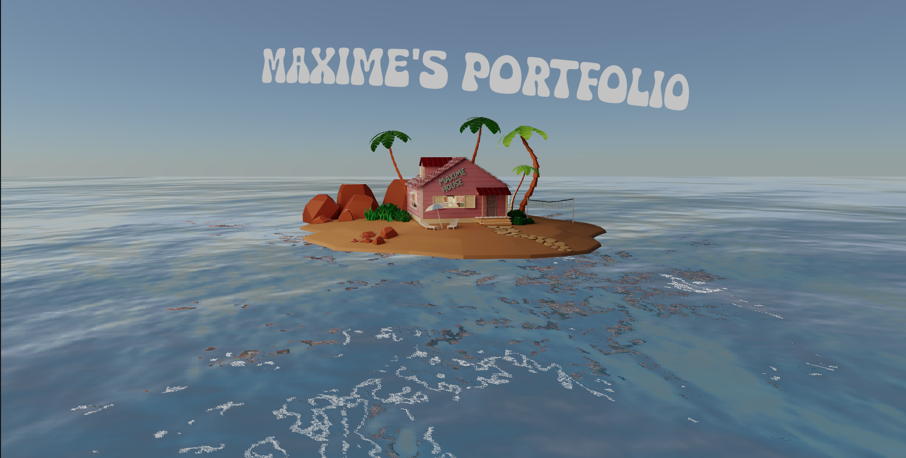

# Nakshatra House Portfolio

### Welcome to my portfolio

Hi everyone, thanks for being here.

I am a computer science and engineering student. I made this interactive 3D portfolio to showcase my web development skills.

Some details about this project:

This project was built with React Three Fiber and Three.js. I used helpers from Drei and animated the camera via GSAP. Custom shaders were written using GLSL, and the house model was designed and optimized in Blender. 

If you notice any bugs or have any questions, please contact me.

**Go live:** https://Nakshatra214.github.io/Portfoilo-website/
